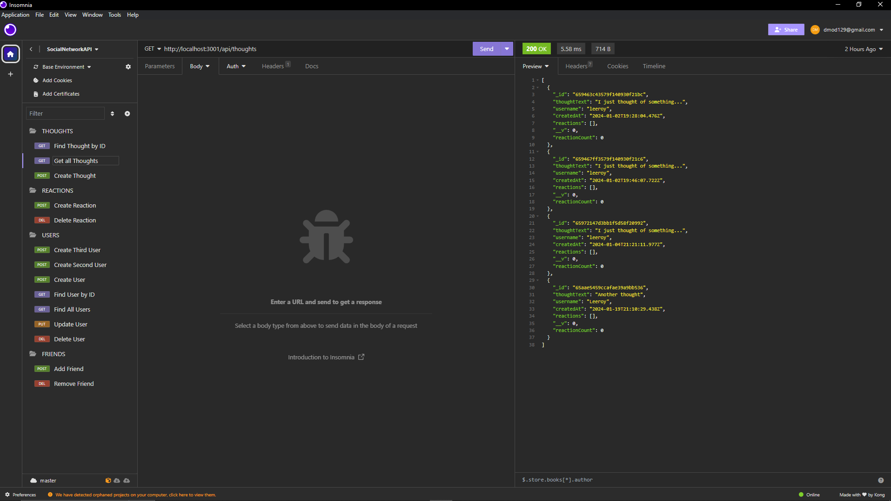

# socialNetworkAPI

## Description
- My motivation for this project was to create a working social network API.
- I built this project using JavaScript, MongoDB, Mongoose, and Express.
- This app allows for the creation, updating, and deletion of users, thoughts, reactions, and friends.
- I learned from making this application how to use MongoDB.

## Installation
- Enter 'npm install' then 'npm start' to get the application started.

## Usage
- This app runs in insomnia.

https://drive.google.com/file/d/1ljI_VTvA1hhqFhrIpmNZ-DT9pyP6jZtz/view

## Credits
N/A

## License
MIT

